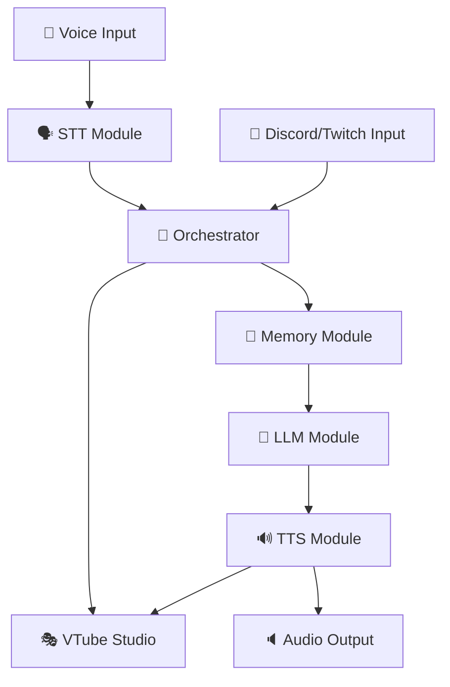

<div align="center">
  
  <!-- Анимированный заголовок -->
  
  
  <h1>🎥 Локальный AI-стример Velpur</h1>
  
  
  
  <p>
    
    
    
    
  </p>
  
</div>

---

## 🎯 О проекте

**Vel4Twi** — это революционный проект с открытым исходным кодом, позволяющий запустить полнофункциональную AI-стримершу по имени **Velpur** прямо на вашем компьютере. 

🚀 **Velpur** — это не просто чат-бот. Это виртуальная личность с собственным характером, памятью и способностью взаимодействовать со зрителями.

---

## ✨ Ключевые возможности

<table>
  <tr>
    <td width="33%" align="center">
      <h3>🤖 Продвинутый AI</h3>
      <p>Локальная LLM через LM Studio</p>
      <p>Характер Velpur через детальный промпт</p>
    </td>
    <td width="33%" align="center">
      <h3>🗣️ Обработка речи</h3>
      <p>STT: Whisper для распознавания</p>
      <p>TTS: Coqui TTS + XTTS v2</p>
    </td>
    <td width="33%" align="center">
      <h3>🎭 VTube Studio</h3>
      <p>Автоматические анимации</p>
      <p>Lip Sync и Idle-анимации</p>
    </td>
  </tr>
</table>

<table>
  <tr>
    <td width="50%" align="center">
      <h3>💬 Мультиплатформенность</h3>
      <p>• Discord (текст + голос)</p>
      <p>• Twitch Chat</p>
      <p>• Командная строка</p>
    </td>
    <td width="50%" align="center">
      <h3>🧠 Долгосрочная память</h3>
      <p>• SQLite база данных</p>
      <p>• Автоизвлечение фактов</p>
      <p>• История диалогов</p>
    </td>
  </tr>
</table>

---

## 🔧 Технологический стек

<div align="center">
  
  <table>
    <tr>
      <td align="center" width="20%">
        <h4>🚀 Основа</h4>
        <br/>
        <strong>Python + PyTorch</strong>
      </td>
      <td align="center" width="20%">
        <h4>🤖 AI/ML</h4>
        <br/>
        <br/>
        
      </td>
      <td align="center" width="20%">
        <h4>🎮 Интеграции</h4>
        <br/>
        <br/>
        
      </td>
      <td align="center" width="20%">
        <h4>💾 Данные</h4>
        <br/>
        <strong>SQLite + JSON</strong>
      </td>
      <td align="center" width="20%">
        <h4>🔊 Аудио</h4>
        <br/>
        <strong>VB-CABLE</strong>
      </td>
    </tr>
  </table>
  
</div>

---

## 🛠️ Архитектура



### 📋 Принцип работы

1. **📲 Ввод:** Получение сообщений из Discord, Twitch или голосовых сообщений
2. **🔍 Обработка:** Whisper преобразует голос в текст
3. **🧠 Мышление:** Локальная LLM генерирует ответ с учетом контекста
4. **🗣️ Ответ:** Coqui TTS синтезирует голос Velpur
5. **🎭 Анимация:** VTube Studio оживляет аватар

---

## 🚀 Быстрый старт

### ⚙️ Требования

- 🐍 **Python 3.9+**
- 🔥 **PyTorch** (с поддержкой CUDA для GPU)
- 🎨 **LM Studio**
- 🎭 **VTube Studio** 
- 🔊 **Виртуальный аудиокабель** (VB-CABLE)

### 💻 Установка

```bash
# Клонирование репозитория
git clone https://github.com/BBQQYT/Vel4Twi.git
cd Vel4Twi

# Установка зависимостей
pip install -r requirements.txt

# Установка FFmpeg (необходим для аудио)
# Windows: скачать с официального сайта
# Linux: sudo apt install ffmpeg
```

### ⚙️ Настройка

<details>
<summary>🔧 <strong>Подробная настройка</strong></summary>

#### 1. **LM Studio**
- Скачайте и запустите LM Studio
- Загрузите совместимую модель (Mistral, Llama и т.д.)
- Запустите Local Server

#### 2. **VTube Studio** 
- Запустите VTube Studio и загрузите аватар
- Включите API (Start API)
- Создайте хоткеи для анимаций

#### 3. **config.json**
При первом запуске файл создастся автоматически. Отредактируйте:
- `discord_token`: Токен вашего Discord-бота
- `twitch_token`, `twitch_nickname`, `twitch_channel`: Данные Twitch
- `llm_model_name_lmstudio`: Имя модели из LM Studio
- `speaker_wav_path_tts`: Путь к .wav файлу для клонирования голоса

</details>

### 🚀 Запуск

```bash
python main.py
```

При первом запуске VTube Studio запросит разрешение на подключение. Разрешите его!

---

## 📈 Дорожная карта

- [ ] 🕰️ **v1.1** - Компьютерное зрение (OCR)
- [ ] 🌍 **v1.2** - Веб-интерфейс для настроек
- [ ] 🎥 **v1.3** - Поддержка YouTube Live
- [ ] 🤖 **v2.0** - Мультимодальные модели (Vision + Audio)

---

## 🤝 Вклад в развитие

Мы приветствуем любой вклад! 🎉

1. **Fork** репозитория
2. **Создайте** feature ветку
3. **Отправьте** Pull Request

### Идеи для вклада:
- 🔧 Оптимизация производительности
- 🌍 Новые платформы интеграции
- 🎨 Улучшение анимаций
- 📝 Документация и переводы

---

## 📜 Лицензия

Этот проект распространяется под лицензией **GPL-3.0**. Подробности см. в файле [LICENSE](LICENSE).

---

## 🙏 Благодарности

Спасибо командам за создание невероятных технологий:
- **OpenAI** за Whisper
- **Coqui** за открытое TTS-решение
- **LM Studio** за удобный интерфейс для локальных LLM
- **VTube Studio** за поддержку API

---

<div align="center">
  
  <h2>💖 Поддержать проект</h2>
  
  <p>Если Vel4Twi помог вам создать что-то удивительное:</p>
  
  <a href="#">
    
  </a>
  <a href="#">
    
  </a>
  <a href="#">
    
  </a>
  
  <!-- Волна внизу -->
  <br/><br/>
  
  
</div>