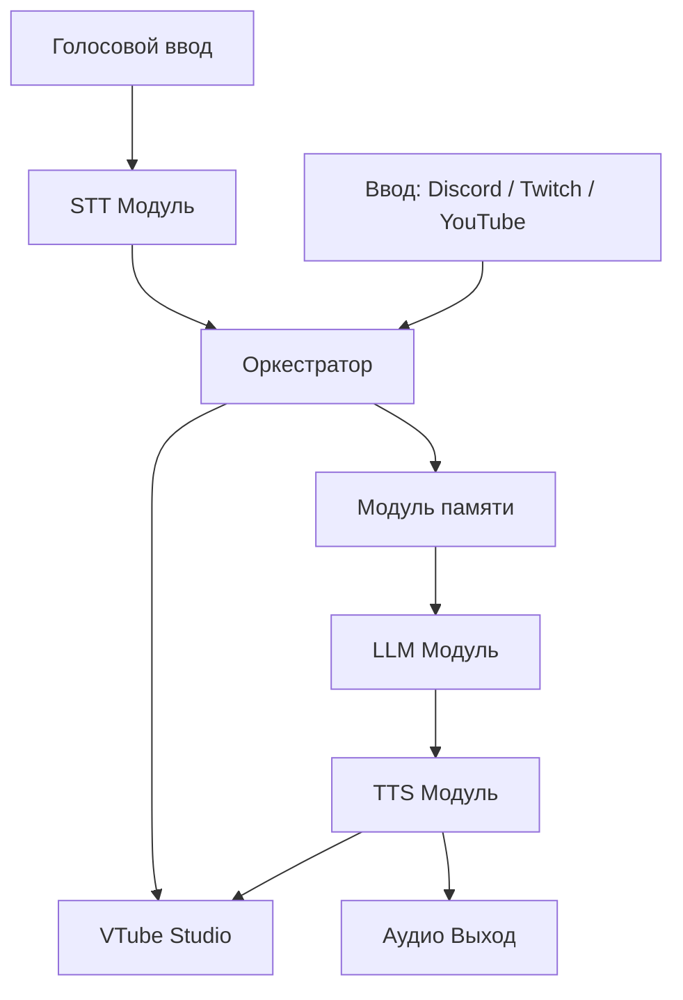

<div align="center">
  
  
  
  <h1> ✧ Локальный AI-стример Velpur ✧ </h1>
  
  
  
  <p>
    
    
    
    
  </p>
  
</div>

<p align="center">
  
</p>

---

## ⋆ ˚｡⋆ О проекте ⋆ ˚｡⋆

**Vel4Twi** — это нежный и ламповый проект с открытым исходным кодом, который поможет вам запустить полнофункциональную AI-стримершу по имени **Velpur** прямо на вашем компьютере.

✧ **Velpur** — это не просто чат-бот. Это виртуальная личность со своим характером, уютной памятью и возможностью тепло общаться со зрителями.

---

## ❀ Ключевые возможности ❀

<table>
  <tr>
    <td width="33%" align="center">
      <h3>✦ Продвинутый AI</h3>
      <p>Локальная LLM через LM Studio</p>
      <p>Мягкий характер Velpur через промпт</p>
    </td>
    <td width="33%" align="center">
      <h3>✦ Обработка речи</h3>
      <p>STT: Whisper для распознавания</p>
      <p>TTS: Coqui TTS + XTTS v2</p>
    </td>
    <td width="33%" align="center">
      <h3>✦ VTube Studio</h3>
      <p>Автоматические анимации</p>
      <p>Lip Sync и Idle-поведения</p>
    </td>
  </tr>
</table>

<table>
  <tr>
    <td width="50%" align="center">
      <h3>♡ Мультиплатформенность</h3>
      <p>⋆ Discord (текст + голос)</p>
      <p>⋆ Twitch Chat</p>
      <p>⋆ YouTube Live Chat</p>
      <p>⋆ Командная строка</p>
    </td>
    <td width="50%" align="center">
      <h3>♡ Долгосрочная память</h3>
      <p>⋆ SQLite база данных</p>
      <p>⋆ Автоизвлечение фактов</p>
      <p>⋆ История диалогов</p>
    </td>
  </tr>
</table>

---

## ✿ Технологический стек ✿

<div align="center">
  
  <table>
    <tr>
      <td align="center" width="20%">
        <h4>✧ Основа</h4>
        <strong>Python + PyTorch</strong>
      </td>
      <td align="center" width="20%">
        <h4>✧ AI/ML</h4>
        <strong>Whisper, LM Studio, Coqui TTS</strong>
      </td>
      <td align="center" width="20%">
        <h4>✧ Интеграции</h4>
        <strong>Discord, Twitch, YouTube, VTube Studio</strong>
      </td>
      <td align="center" width="20%">
        <h4>✧ Данные</h4>
        <strong>SQLite + JSON</strong>
      </td>
      <td align="center" width="20%">
        <h4>✧ Аудио</h4>
        <strong>FFmpeg, VB-CABLE</strong>
      </td>
    </tr>
  </table>
  
</div>

---

## ୨୧ Принцип работы ୨୧


```mermaid
graph TB
    A[ Ввод: Discord / Twitch / YouTube ] --> B[ Оркестратор ]
    C[ Голосовой ввод ] --> D[ STT Модуль ]
    D --> B
    B --> E[ Модуль памяти ]
    E --> F[ LLM Модуль ]
    F --> G[ TTS Модуль ]
    G --> H[ VTube Studio ]
    G --> I[ Аудио Выход ]
    B --> H
```

⋆ **Получение:** Входящие сообщения из чатов или голосовые сообщения бережно собираются в очередь.
⋆ **Обработка:** Whisper внимательно слушает и преобразует голос в текст.
⋆ **Мышление:** Локальная LLM придумывает ответ с учетом прошлых бесед и очищается от тегов размышлений.
⋆ **Ответ:** Coqui TTS синтезирует мягкий голос Velpur.
⋆ **Анимация:** VTube Studio добавляет жизнь и эмоции аватару.

---

## ⋆ Быстрый старт ⋆

### ❀ Требования

- ⋆ **Python 3.9+**
- ⋆ **PyTorch** (с поддержкой CUDA для GPU)
- ⋆ **LM Studio**
- ⋆ **VTube Studio**
- ⋆ **Виртуальный аудиокабель** (VB-CABLE)

### ❀ Установка

```bash
# Клонирование репозитория
git clone https://github.com/BBQQYT/Vel4Twi.git
cd Vel4Twi

# Установка FFmpeg (необходим для работы со звуком)
# Windows: скачать с официального сайта и добавить в PATH
# Linux: sudo apt install ffmpeg
```

### ❀ Настройка

<details>
<summary>✧ <strong>Подробная настройка</strong></summary>

⋆ **1. LM Studio**
- Скачайте и запустите LM Studio.
- Загрузите подходящую модель.
- Запустите локальный сервер.

⋆ **2. VTube Studio**
- Запустите VTube Studio и загрузите свой аватар.
- Включите API (Start API) и разрешите подключение.
- Настройте горячие клавиши для эмоций.

⋆ **3. Конфигурация**
- При запуске через веб-интерфейс или скрипт создастся нужная конфигурация.
- Вы можете настроить токены Discord, Twitch и другие параметры в удобном Web UI.

</details>

### ❀ Запуск

Теперь для удобства добавлены скрипты автозапуска! Они сами проверят окружение, установят зависимости и запустят проект.

**Для Windows:**
```cmd
start.bat
```

**Для Linux / macOS:**
```bash
bash start.sh
```

При первом запуске VTube Studio мягко попросит разрешение на подключение — обязательно разрешите его.

---

## ❁ Дорожная карта и недавние обновления ❁

- [x] ✦ **v1.1** - Компьютерное зрение (OCR) и поддержка Tool Calling для LLM
- [x] ✦ **v1.2** - Веб-интерфейс для настроек (Web UI на порту 8080)
- [x] ✦ **v1.3** - Интеграция с YouTube Live чатом
- [x] ✦ **v1.4** - Скрипты автозапуска (`start.bat` / `start.sh`) и автоустановка зависимостей
- [x] ✦ **v1.5** - Обработка и фильтрация тегов `<think>` из ответов
- [x] ✦ **v1.6** - Централизованная очередь запросов (Orchestrator)
- [ ] ✧ **v2.0** - Мультимодальные модели (Vision + Audio напрямую)

---

## ♡ Вклад в развитие ♡

Будем очень рады любой вашей помощи и пулл-реквестам!

1. **Форкните** репозиторий ⋆
2. **Создайте** новую ветку ⋆
3. **Отправьте** Pull Request ⋆

---

## ✧ Лицензия ✧

Проект распространяется под лицензией **GPL-3.0**. Все подробности можно найти в файле [LICENSE](LICENSE).

---

<div align="center">
  
  <h2>♡ Поддержать проект ♡</h2>
  
  <p>Если Velpur принесла немного уюта и радости в ваш день:</p>
  
  <a href="#">
    
  </a>
  <a href="#">
    
  </a>
  
  <br/><br/>
  
  
</div>