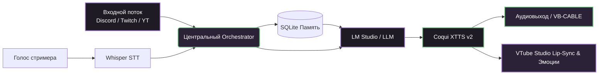

<div align="center">

  

  # ✦ Velpur (Vel4Twi) ✦
  ### *Локальный автономный AI-стример и виртуальная личность*

  <p align="center">
    
    
    
    
    
    
  </p>

  <p align="center">
    <b>Полнофункциональная AI-стримерша с характером, живым голосом, долговременной памятью и трекингом эмоций.</b>
  </p>

  ---
</div>

## ⋆ ˚｡ О проекте

**Vel4Twi** — модульный open-source фреймворк для локального запуска интерактивной AI-стримерши по имени **Velpur**. 

В отличие от стандартных чат-ботов, проект связывает воедино языковую модель, распознавание речи, синтез голоса в реальном времени, долговременную память и анимацию Live2D/3D-модели через VTube Studio.

> [!TIP]
> Все ключевые модули (LLM, STT, TTS) работают **полностью локально** на вашем компьютере, гарантируя конфиденциальность и минимальную задержку ответов.

---

## ⚡ Ключевые возможности

* 🧠 **Локальный интеллект:** интеграция с LM Studio, поддержка Tool Calling, фильтрация служебных тегов `<think>` и кастомный системный промпт.
* 🎙️ **Голосовой пайплайн:** быстрое распознавание речи через **OpenAI Whisper** и мягкий, естественный синтез голоса на базе **Coqui XTTS v2**.
* 🎭 **Интерактивный аватар:** прямое управление **VTube Studio API** (автоматический Lip Sync, переключение выражений лица и реакций).
* 🌐 **Мультиплатформенность:** одновременная работа с чатами **Twitch**, **YouTube Live**, серверами **Discord** (текст + голосовой канал) и CLI.
* 💾 **Долговременная память:** автоматическое извлечение фактов о собеседниках и сохранение контекста в **SQLite**.
* 🎛️ **Web UI:** встроенная панель управления на порту `8080` для тонкой настройки без редактирования конфигов вручную.

---

## 🛠️ Стек технологий

| Категория | Технологии |
| :--- | :--- |
| **Ядро** | Python 3.9+, PyTorch (CUDA), Asyncio |
| **AI / ML** | LM Studio (Local LLM), Whisper (STT), Coqui TTS / XTTS v2 (TTS) |
| **Аватар** | VTube Studio API, WebSockets |
| **Интеграции** | Twitch API, YouTube Live Chat API, Discord.py |
| **Хранилище** | SQLite, JSON State Store |
| **Аудио** | FFmpeg, VB-Audio Cable |

---

## ୨୧ Архитектура пайплайна


```mermaid
flowchart LR
    A[Входной поток<br>Discord / Twitch / YT] --> B(Центральный Orchestrator)
    Mic[Голос стримера] --> STT[Whisper STT] --> B

    B --> Mem[(SQLite Память)]
    Mem --> LLM[LM Studio / LLM]
    B --> LLM
    
    LLM --> TTS[Coqui XTTS v2]
    TTS --> Audio[Аудиовыход / VB-CABLE]
    TTS --> VTS[VTube Studio Lip-Sync & Эмоции]

    style A fill:#1e1b24,stroke:#9B72C7,stroke-width:2px,color:#fff
    style B fill:#2b2238,stroke:#60BA70,stroke-width:2px,color:#fff
    style LLM fill:#1e1b24,stroke:#9B72C7,stroke-width:2px,color:#fff
    style TTS fill:#1e1b24,stroke:#60BA70,stroke-width:2px,color:#fff
    style VTS fill:#2b2238,stroke:#9B72C7,stroke-width:2px,color:#fff
    style Audio fill:#2b2238,stroke:#60BA70,stroke-width:2px,color:#fff

```

---

## 🚀 Быстрый старт

### Системные требования

* **ОС:** Windows 10/11 или Linux
* **GPU:** NVIDIA GPU с поддержкой CUDA (рекомендуется от 6–8 GB VRAM)
* **ПО:** [LM Studio](https://lmstudio.ai/), [VTube Studio](https://store.steampowered.com/app/1325860/VTube_Studio/), [VB-CABLE Driver](https://vb-audio.com/Cable/), [FFmpeg](https://ffmpeg.org/)

### 1. Клонирование репозитория

```bash
git clone [https://github.com/BBQQYT/Vel4Twi.git](https://github.com/BBQQYT/Vel4Twi.git)
cd Vel4Twi

```

### 2. Запуск

Скрипты автозапуска сами создадут виртуальное окружение, установят зависимости и инициализируют проект:

**Windows:**

```cmd
start.bat

```

**Linux / macOS:**

```bash
chmod +x start.sh
./start.sh

```

> [!IMPORTANT]
> При первом запуске в окне **VTube Studio** появится системное уведомление — обязательно подтвердите подключение API плагина.

1. **LM Studio:**
* Загрузите квантованную модель (например, Qwen, Mistral или Llama).
* Перейдите во вкладку **Local Server** и запустите сервер на порту `1234`.


2. **VTube Studio:**
* Откройте *Settings* ➔ включите пункт **Start API**.
* Убедитесь, что настроены параметры аудиовхода на виртуальный кабель.


3. **Web-панель настроек:**
* После старта скрипта откройте `http://localhost:8080` в браузере для ввода токенов Twitch/Discord и выбора голоса.


---

## 📈 Roadmap & История версий

* [x] **v1.1** — Модуль OCR (компьютерное зрение) и Tool Calling для LLM
* [x] **v1.2** — Интерактивный Web UI для управления параметрами
* [x] **v1.3** — Двусторонняя интеграция с YouTube Live Chat
* [x] **v1.4** — Кроссплатформенные скрипты автоустановки и запуска
* [x] **v1.5** — Парсер и фильтрация скрытых блоков рассуждений (`<think>`)
* [x] **v1.6** — Централизованный асинхронный оркестратор очередей
* [ ] **v2.0** — Полный переход на Native Multimodal Vision + Direct Audio Pipeline

---

## 🤝 Вклад в проект

Будем рады пулл-реквестам и идеям!

1. Сделайте **Fork** проекта
2. Создайте feature-ветку (`git checkout -b feature/AmazingFeature`)
3. Закоммитьте изменения (`git commit -m 'Add some AmazingFeature'`)
4. Сделайте Push в ветку (`git push origin feature/AmazingFeature`)
5. Откройте **Pull Request**

---

## 📄 Лицензия

Проект распространяется под свободной лицензией **GNU General Public License v3.0**. Подробности в файле [LICENSE](https://www.google.com/search?q=LICENSE).

---
